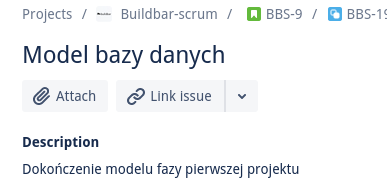

# Jira usage guide

## Table of contents

- [Jira usage guide](#jira-usage-guide)
  - [Table of contents](#table-of-contents)
  - [Task status](#task-status)
    - [Backlog](#backlog)
    - [Selected for development](#selected-for-development)
    - [In progress](#in-progress)
    - [Verification](#verification)
    - [Done](#done)
  - [Reporting](#reporting)
  - [Linking pull requests](#linking-pull-requests)

## Task status

In our scrum project, any task can have one of the following statuses:
- Backlog
- Selected for development
- In progress
- Verification
- Done

Task status descriptions:

### Backlog

A backlog is like a big collection of tasks that are waiting to get assigned to
someone. They should already have their descriptions' filled in, though. 

### Selected for development

This status means that a reporter of a task selected an assignee (a person which
the reporter thinks should do the task). This status is meant to be a reminder
to individual assignees, that they should think about starting a task, or such
task could be of greater priority that those remaining in the backlog.

### In progress

This status is assigned when an assignee starts work on a given task, it
indicates that progress is happening now and that the task isn't finished yet.

### Verification

This status indicates that a task is finished. Changing a status to verification
should also come with a confirmation of task completion, such as linking a PR or
providing a screenshot. This also means that the reporter should start reviewing
the work, possibly returning the task to In progress, which would mean that the
task is far from done.

### Done

This status is assigned by the reporters after thoroughly reviewing the work
done, checking that everything listed in the task is done and merging any linked
PRs.

## Reporting

A reporter is ususally a person that is quite knowledgeable in a topic, enough
to verify the validity of produced code. This person is responsible for filling
in task descriptions - as much as they can, so that anyone browsing or assigned
to a task has a clear view of how and what needs to be done. They are also
responsible for reviewing PRs and tasks, so that every specification listed to
be done in the task is finished. They should also keep in mind maintaining
github repositories, so that a feature done in the task is properly documented
and doesn't mess up the main branch.

## Linking pull requests

Any pull requests (PRs) associated with a task should be linked under Web links,
so that even after a long discussion in the comments, it is still easy to find
the pull request.

See picture above. Click the arrow -> `Add web link` -> copy the PR link, you
can leave the `Link text` blank.
